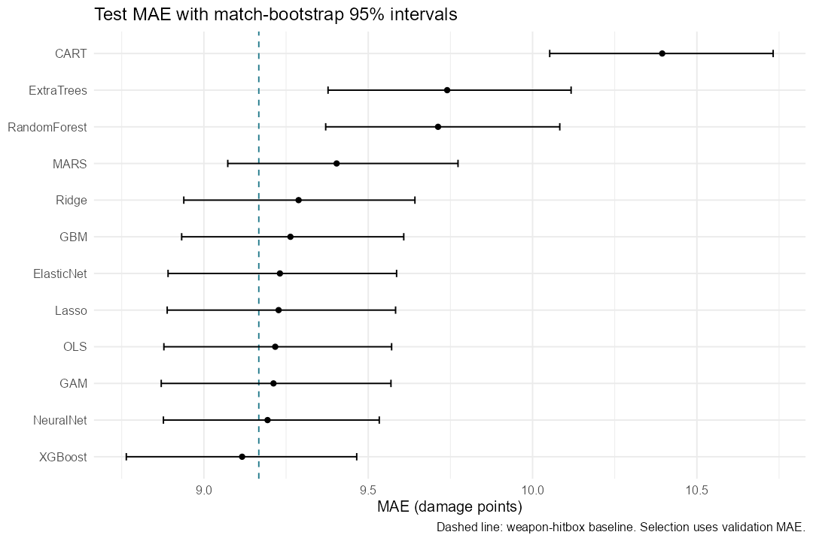

# CS GO xD

Development milestones were reconstructed from shared offline work; dates and primary author allocation are approximate. See [history and contribution disclosure](docs/OFFLINE_HISTORY.md).

Expected damage modelling and spatial diagnostics in CS:GO, implemented in modular R scripts with SQLite and 12 regression methods.

- [Research paper](paper/CSGO_xD_Research_Paper.docx): measured findings, methods, statistical validation, limitations, and all 12 model heatmap comparisons.
- [Measured analysis report](results/analysis_report.md) and [model metrics](results/model_comparison.csv).
- [Results gallery](results/index.html): download or clone the repository and open this HTML file locally to browse 224 heatmaps, 12 ordinary plots and three interactive charts.
- [Validation evidence](VALIDATION.md) and [paper regeneration guide](paper/README.md).
- [Eight-slide DA2 presentation](presentation/DA2_CS_GO_xD.pptx), [professor question preparation](presentation/Professor_Preparation.md) and [Windows live demo helpers](presentation/live_demo.R).



This project fixes the original R scripts for portable execution in Linux RStudio and adds the evaluation criteria: feature engineering and selection, real SQLite ingestion and retrieval, and 12 regression methods. Each successful model generates its own expected-damage and residual radar heatmaps. A separate script creates ordinary and interactive visualizations demonstrating the supplied R syllabus.

The supplied research document describes **expected damage (xD)** as the first stage toward expected kills (xK). The target here is `hp_dmg + arm_dmg` per recorded hostile-player damage event. It is not a kill probability. Misses and no-damage opportunities are absent, and the ESEA kill CSVs lack attacker/victim IDs and positions. A timing-only join cannot reliably identify lethal damage events. Dividing damage by 100 would not produce a calibrated expected-kills model. These scripts therefore label outputs as xD throughout. The original DOCX is retained at `paper/template/reference.docx` as a formatting reference and background draft; its approximate figures and placeholders are not treated as measured results. The new paper uses the verified production results.

The committed `results/` directory is a frozen production snapshot. New runs write to `output/` and `models/`, which are ignored by Git. The raw Kaggle archive, local package libraries, fitted models and SQLite database are regenerated locally. Obtain the data from [the original Kaggle dataset](https://www.kaggle.com/datasets/skihikingkevin/csgo-matchmaking-damage); it is not included in this repository. Radar backgrounds embedded in derived plots come from that archive and retain their original rights.

## Quick start in Linux RStudio

1. Copy the project scripts, `R/` folder, project file and documentation to Linux, along with the extracted `archive (3)` directory. Alternatively rename the data directory to `archive`. The source ZIP includes the project code but excludes the data and platform-specific `.R-library`; install packages on Linux separately.
2. Open `csgo_xD.Rproj`. This sets the project working directory and disables workspace restoration and saving, avoiding stale objects and huge `.RData` files.
3. In the RStudio console, run:

```r
source("00_install_packages.R")
Sys.setenv(CSGO_SMOKE = "1")
source("run_all.R")
```

The smoke run reads the first 250,000 raw rows of **each** damage part, retains at most 100 usable events from each of the first 30 matches in that prefix, and fits smaller models. It exercises the complete workflow but cannot represent the full archive. `run_manifest.json` records `smoke: true`.

4. For the full archive import and default bounded analysis, run:

```r
Sys.unsetenv("CSGO_SMOKE")
source("run_all.R")
```

The production database is separate from the smoke database. Full ingestion scans both damage files; **modeling remains sampled** at a maximum of 60,000 events, with at most 20,000 training rows. Full import is the slowest step and may take substantial time depending on storage and CPU. Subsequent runs reuse completed imports.

To keep smoke results for comparison, copy `output/` and `models/` to another location before the full run. Both modes write to those same result directories. The active run's manifest and status table are the authority; do not mix figures from different runs.

If your data lives elsewhere:

```r
Sys.setenv(CSGO_DATA_DIR = "/home/yourname/Downloads/archive")
source("run_all.R")
```

If the working directory is wrong, use `setwd("/path/to/project")` first. `CSGO_PROJECT_ROOT` is available for scripted use, but the entry scripts should still be sourced from the project root. No script requires `rstudioapi`, the active editor, or a separate frontend folder.

## Terminal execution

```bash
cd /path/to/project
Rscript 00_install_packages.R
CSGO_SMOKE=1 Rscript run_all.R
# Production mode, after the smoke run succeeds:
Rscript run_all.R
```

Use a recent supported R version. Packages are installed into `.R-library` in the project, supplementing your existing libraries. **Do not copy the Windows `.R-library` to Linux**; compiled packages are platform-specific. Run the installer on Linux. The installer checks failures explicitly and uses sequential dependency installation. `nnet`, `mgcv`, and `rpart` are normally bundled with R; they are checked too.

If Linux package installation fails because headers/compiler tools are missing, on Ubuntu/Debian install the relevant system dependencies:

```bash
sudo apt update
sudo apt install r-base-dev build-essential gfortran libcurl4-openssl-dev \
  libssl-dev libxml2-dev libpng-dev libfontconfig1-dev libfreetype6-dev \
  libharfbuzz-dev libfribidi-dev libjpeg-dev libtiff-dev
```

System package names vary by distribution. Inspect the install error rather than assuming every failure requires all of these libraries. XGBoost compilation can be demanding; a current R/CRAN combination is preferable. Output HTML uses adjacent asset folders and does not require Pandoc; keep those folders beside the HTML files.

## Running individual stages

```r
source("database.R")       # import once; full aggregates and audit
source("pipeline.R")       # sample, split, fit, evaluate, save predictions
source("heatmaps.R")       # redraw saved held-out predictions
source("visualizations.R") # separate static and interactive syllabus graphics
source("api_demo.R")       # optional REST/JSON exercise; internet needed
```

`run_all.R` executes the first four stages. The optional API example downloads public Valve repository metadata from GitHub, parses JSON, and saves a few fields. This live response changes over time and is not used for model fitting. It does not claim to download or authenticate against Kaggle.

## What changed and why

The original scripts pointed at a particular `/home/hardik/Downloads` directory, derived paths from RStudio's active editor, assumed images in a nonexistent frontend directory, loaded a complete CSV, and copied it repeatedly into training, encoding, and inference objects. The new scripts locate the supplied archive relative to the project, use its actual radar images, and stream CSV chunks into an indexed SQLite database. Metadata is joined by demo filename after checking that each filename has a single map. Both ESEA parts are included in production mode. Matchmaking (`mm_*`), kill, and grenade CSVs are left out of the damage model because they have different schemas and populations; their presence does not imply they were analyzed.

Only needed columns are parsed. Player/Steam IDs, ranks, and team names are not stored in the model dataset or exported predictions. Invalid numeric data, impossible damage outside 0-100 for either damage component, missing positions, the `(0,0)` position sentinel, invalid hitboxes, unknown weapons, environmental damage, and same-side damage are filtered. Positive health-plus-armor damage is required; missing damage is dropped instead of silently filled with zero. Each import audit records raw and retained row totals. These filters define the population and may remove unusual legitimate records; they should be reviewed for the research question.

SQLite is an actual on-disk database, not a token connectivity example. Ingestion is transactional per part, `file` is indexed for retrieval, and aggregates are computed using SQL. Interrupted imports roll back that file; completed imports are reused. Input file size and modification time are checked for stale reuse. This is a practical change detector, not a cryptographic checksum. If inputs or cleaning logic change, move the `database/` folder aside and rebuild; the pipeline does not automatically migrate old cleaning rules. Do not run two import processes against the same database.

## Memory and sampling on a 16 GB computer

| Setting | Default | Purpose |
|---|---:|---|
| CSV chunk | 50,000 rows | Bounds parse and write memory |
| SQLite cache | about 64 MiB | Keeps database reads disk backed |
| Analysis sample | at most 60,000 rows | Bounds matrices, EDA, and prediction caches |
| Training subset | at most 20,000 rows | Bounds all model fits |
| Per-match cap | 250 rows | Stops large matches dominating the sample |
| Worker threads | 2 | Avoids CPU oversubscription |
| Heatmap grid | 40 by 40 | Avoids costly KDEs and very large rasters |
| Bootstrap | 500 replicates | Works on per-match sums, not giant resampled tables |

These are conservative resource controls, **not a guarantee that RStudio cannot crash**. Other programs, package builds, native allocations, and available disk space still matter. Keep several GB of free disk for SQLite, indexing, transactions, saved models, and figures. Close unused large workspaces. `gc()` runs between models and radar renders. Learners run sequentially; there is no full-dataset inference matrix.

For a smaller production analysis:

```r
Sys.setenv(CSGO_SAMPLE_ROWS = "30000", CSGO_FIT_ROWS = "10000",
           CSGO_CHUNK_ROWS = "25000", CSGO_THREADS = "2")
source("run_all.R")
```

The sample retrieves matches in a seeded, map-balanced round robin, then at most the configured cap per match using deterministic pseudo-random tick/round ordering in SQL. This ordering is a resource-friendly sampling device, not a proven uniform random sampler. Small maps exhaust their matches naturally. A bounded training subset is drawn randomly from the sampled training partition and shared by all learners. Sample counts are not estimates of population map/weapon frequencies. The separately labelled SQL map counts summarize all imported cleaned records instead.

## Feature engineering and selection

Engineered predictors are horizontal attacker-victim distance, `log1p(distance)`, numeric bomb state, and consistent parser-time bins at 20 and 60 seconds. Raw positions, map identity, weapon, weapon class, hitbox, attacker side, bomb site, and timing are available as predictors. Victim side is omitted because hostile-player filtering makes it determined by attacker side. No health/armor damage columns or player IDs enter the feature matrix; damage components are only the target.

All preprocessing is fitted on the actual capped training subset. Categorical variables use one-hot columns, with a maximum of 25 retained levels per field and one reference level omitted. Rare/unseen categories fall back to the reference representation; this loses information and is disclosed as a limitation. Zero-variance features are removed. Numeric predictors with training absolute correlation above .98 are removed sequentially. The remaining columns are standardized with training means and standard deviations. Validation and test data receive the frozen transformation. Feature lists and fitted preprocessing are saved.

Permutation importance shuffles each encoded feature in the validation partition for the selected learned model and reports the increase in MAE. It is a diagnostic, not causal attribution or a second selection pass. Correlated dummy variables can distort individual importance. If the simple baseline wins, there is no learned-matrix permutation chart.

## Algorithms and validation tuning

| Method | Implementation | Validation choice |
|---|---|---|
| Ordinary least squares | `stats::lm.fit` | Fixed linear fit; aliased coefficients set to zero |
| Ridge regression | `glmnet`, alpha 0 | Lambda along fitted regularization path |
| Lasso regression | `glmnet`, alpha 1 | Lambda along fitted regularization path |
| Elastic net | `glmnet`, alpha .5 | Lambda along fitted regularization path |
| CART regression tree | `rpart` | Complexity parameter .005 or .02 |
| Random forest | `ranger` | Minimum node size 10 or 30 |
| Extremely randomized trees | `ranger`, extratrees | Minimum node size 10 or 30 |
| Gradient boosting | `gbm` | Tree interaction depth 2 or 4 |
| XGBoost | `xgboost` | Depth 3 or 5 plus validation early stopping |
| MARS | `earth` | Degree 1 or 2 |
| Generalized additive model | `mgcv::bam` | Fixed small smooth bases |
| Neural network | `nnet` | One hidden layer, 5 or 10 units |

These are 12 implemented regression methods, including related regularized linear methods and two related forest methods; they are not 12 unrelated model families. The rubric says ML/DL; it does not require deep learning. The neural network here is shallow. Deep neural models are not justified by the tabular data or laptop constraint. The weapon-by-hitbox mean is an additional training-only baseline, with global mean fallback for unseen combinations, and does not count toward the 12 methods.

Hyperparameter search is deliberately small. Forest depth, MARS basis count, GAM smooth size, boosting rounds, and neural iterations are bounded in code. XGBoost supports current `evals` and older `watchlist` APIs. Models are selected by **validation MAE only**, and the baseline can win. The test set is used only for reporting. `model_status.csv` records successes, runtime, and error messages. A failed model does not masquerade as a successful implementation; fewer than ten successes produce a warning and require repair before submission.

GAM fitting uses `bam` with discretized fitting for efficiency, but scoring uses `discrete = FALSE`. This makes predictions consistent when you score a row by itself or as part of a larger batch; new-data discretization can otherwise introduce small batch-dependent differences.

## Statistical validation and reading results

Matches are split within maps where possible, approximately 70% training, 15% validation, and 15% testing. Every sampled event from a demo stays in one partition. Maps with fewer than three sampled matches receive a seeded global-probability assignment; some such maps may be absent from training or testing. Split assertions guard against match overlap and empty partitions. At least five test matches are required for statistical reporting.

For every model, outputs report event-weighted MAE, RMSE, R squared, and signed bias on identical held-out sampled events. Match-cluster bootstrap intervals resample test matches with replacement and combine their sufficient statistics, preserving dependence among events within a match. The interval is conditional on the fitted model and this sampling policy; it does not include uncertainty from refitting or resampling the entire archive.

A paired match-level sign-flip randomization test compares absolute-error improvement against the weapon-hitbox baseline. Positive improvement means the model has lower MAE. Holm adjustment addresses multiple comparisons across the successful algorithms. The sign-flip test assumes exchangeability/symmetry of match-level differences under the null and is exploratory; a small p-value does not establish tactical causation. With 500 replicates, Monte Carlo p-values have finite resolution. Validation selection and repeated experiments can introduce selection effects; one held-out split does not replace an external validation study.

Do not rank models using test results and then claim the test set remained untouched for selection. Inspect the validation-selected model, uncertainty intervals, baseline improvement, residual plot, and regression-calibration plot together. Predictions are not clipped to 0-200 for metrics: impossible regression predictions remain visible in evaluation. Heatmap color scales have display limits only.

## Heatmaps

Each successful learner and the baseline receives a directory under `output/heatmaps/` containing expected-damage PNGs, residual PNGs, and CSV grids for every map represented in the **test sample**. Shared observed-damage and event-count maps are saved once in the heatmap root. Maps without test events cannot receive a defensible held-out heatmap.

Every map uses a 40 by 40 spatial grid in attacker coordinates. CSV grids contain event count, distinct match count, actual mean, predicted mean, residual mean, and cell centers. Means require at least five events **and two matches** per cell; unsupported cells are transparent. Count maps show all occupied cells. Empty/transparent space means insufficient support or no data, not zero expected damage. `heatmap_support.csv` reports support and out-of-bounds events.

Calibration comes from the archive's actual `StartX`, `EndX`, `StartY`, and `EndY`. X and Y scales are handled independently, with increasing game Y upwards in plotting and image rows displayed from top to bottom. World-coordinate bounds are preserved. Radar images are used only if calibration and PNG both exist; otherwise figures are explicitly labelled as schematic. Only some maps have calibration in the supplied small CSV. Out-of-bounds positions are excluded from the displayed grid and counted. The overlay is a visualization based on supplied calibration; inspect known landmarks before making tactical claims. Multi-floor maps cannot be separated because height is absent.

Predicted and actual damage use a common 0-200 color range; residuals use -100 to 100 and mark zero at the midpoint. These common ranges support comparison; saturation is a display effect and grid CSVs retain original values. Red residual cells mean greater realized damage than predicted, blue mean lower. Neither proves player skill, favorable tactics, or round-winning value. Sampling and support thresholds can leave very sparse smoke-run maps.

## Syllabus coverage in the separate visualization workflow

| Module | Concrete demonstration |
|---|---|
| 1 Functions | Documented modular functions, built-ins, conditionals, centralized variables, `source()` |
| 2 Vectors and lists | Numeric vector filtering, list access, `lapply()` summaries in `vector_list_summaries.txt` |
| 3 Data wrangling | CSV schema checks, cleaning rules, metadata association, data frames and saved CSV tables |
| 4 dplyr and tidyr | `group_by`, `summarise`, `count`, `distinct`, `left_join`, `pivot_longer`, `pivot_wider`; long/wide exported summaries |
| 5 Databases and APIs | Actual SQLite storage, indexed parameterized retrieval and SQL aggregates; independent optional REST/JSON GitHub example |
| 6 Visualization | ggplot2 bars, histogram, boxplots, range scatter, correlations, uncertainty intervals, calibration and spatial radar maps |
| 7 Interactive visualization | Plotly HTML for weapon classes, range/damage and model comparison, with tooltips, zoom and pan |

Modern `pivot_longer` and `pivot_wider` implement the reshaping concepts of older `gather` and `spread`. Plotly provides the interactive demonstration; Rbokeh and Leaflet are not forced into game-world coordinate plots, where geographic latitude/longitude would be misleading. Keep `.html` files with their adjacent `_files` asset directories when sharing. If Plotly dependencies are missing, the script warns explicitly and saves the static figures.

## Output guide

| Path | Meaning |
|---|---|
| `database/csgo.sqlite` | Complete cleaned production event database |
| `database/csgo_smoke.sqlite` | Small smoke-only database |
| `output/import_audit.csv` | Raw/retained counts per imported part |
| `output/database_summary.csv` | SQL map-by-weapon-class full import aggregates |
| `output/match_splits.csv` | Selected matches, map identity and partition |
| `models/analysis_sample.rds` | Capped dataset used by modeling and sample EDA |
| `models/preprocessor.rds` | Frozen categories, feature selection and scaling |
| `output/selected_features.csv` | Retained model matrix columns and scaling |
| `output/dropped_features.txt` | Removed constants/redundant numeric columns |
| `output/model_status.csv` | Which methods completed and their runtimes |
| `output/model_comparison.csv` | Test metrics, confidence intervals, improvements, p-values and validation selection |
| `output/baseline_metrics.json` | Simple baseline test/validation metrics |
| `output/test_predictions.csv` | Shared test rows and each successful model prediction |
| `output/selected_model.txt` | Winner chosen by validation MAE |
| `models/<method>.rds` | Saved learner and prediction adapter |
| `models/xd_model.json` | Portable XGBoost booster, if successful |
| `models/predictions/` | Small held-out spatial caches, one per model |
| `output/heatmaps/` | Radar/schematic PNGs and spatial grid CSVs |
| `output/eda/` | Separate syllabus charts, tables and interactive HTML |
| `output/run_manifest.json` | Settings, sample size, model successes and package versions |
| `output/sessionInfo.txt` | R/platform/package information for reproducibility |
| `output/analysis_report.md` | Automatically written explanation using the current measured results |
| `output/index.html` | Local gallery linking all model heatmaps and separate visualizations |
| `output/verification.txt` | Post-run checks, after running `verify_results.R` |

To view images, use RStudio's Files pane or your image viewer. To explore Plotly, open an HTML file in a browser. Scripts save PNGs directly without forcing hundreds of plots into RStudio's plot history.

To reload a saved model and predict new **already cleaned/engineered** rows:

```r
source("config.R")
source("R/preprocess.R")
pre <- readRDS(file.path(MODEL_DIR, "preprocessor.rds"))
winner <- readLines(file.path(OUTPUT_DIR, "selected_model.txt"))[1]
model <- readRDS(file.path(MODEL_DIR, paste0(winner, ".rds")))
new_rows <- head(readRDS(file.path(MODEL_DIR, "analysis_sample.rds")), 20)
if (winner == "WeaponHitboxBaseline") {
  predicted <- model(new_rows)
} else {
  check_packages()
  predicted <- model$predict(transform_features(new_rows, pre))
}
print(predicted)
```

Preserve the package versions recorded in the manifest when reproducing results, especially across major XGBoost releases. Seeded code and a saved version manifest support reproducibility but do not freeze package installations; CRAN installation can change in future. Archive the environment or create an `renv` lockfile on the target Linux machine for long-term replication.

Run `source("verify_results.R")` after the workflow, in the same smoke/production mode. It checks match separation, exclusion of damage outcomes from features, exported metric calculations, finite predictions, saved-model reload equivalence in a fresh session, and spatial support invariants. `run_all.R` also writes `output/analysis_report.md` with actual metrics and interpretation for your submission. Do not replace the research paper's result placeholders with smoke-test values.

## Limitations and future work

Recorded-hit conditioning is the main limitation: the model estimates damage given that a damage event was observed, not the value of any possible shot or map location. Weapon and hitbox explain much of a near-deterministic game mechanic. Hitbox is observed after impact, so this is a retrospective conditional model, not a pre-shot forecast. Armor, helmets, remaining health, wall penetration, aim, vertical separation and unrecorded opportunities are missing. Positive residuals are not evidence of skill. Timing semantics should be confirmed against the parser before interpreting phase bins.

The dataset reflects legacy CS:GO ESEA matches. Population transfer to matchmaking, professional play, modern maps or CS2 is untested. Map-balanced capped sampling changes event distributions; rare categories and maps can be poorly represented. One split, limited tuning, shallow networks, and coarse cell grids trade flexibility for laptop resources. Cell means are descriptive and have no per-cell multiple-testing correction or cell confidence intervals. Correlated features can confound permutation importance. Calibration and schematic fallbacks require explicit review.

For genuine xK, obtain/reparse demos with per-player kill labels, victim health before impact, misses and exposure/opportunity definitions; define an engagement window and predict a binary kill outcome on both lethal and nonlethal opportunities. Evaluate Brier score, log loss, discrimination and probability calibration with match-level and time-based holdouts. Sum calibrated probabilities only over a clearly defined opportunity set. Further work can add height/floor maps, armor context, full streaming model inference into SQL spatial aggregates, grouped cross-validation, temporal validation, per-cell match-bootstrap uncertainty, and stronger environment locking.

Data source: [Kaggle CS GO Competitive Matchmaking Data](https://www.kaggle.com/datasets/skihikingkevin/csgo-matchmaking-damage). Implementation references: [DBI](https://dbi.r-dbi.org/reference/dbWriteTable.html), [RSQLite](https://rsqlite.r-dbi.org/reference/SQLite.html), and [XGBoost training API](https://cran.mirror.garr.it/CRAN/web/packages/xgboost/refman/xgboost.html).
